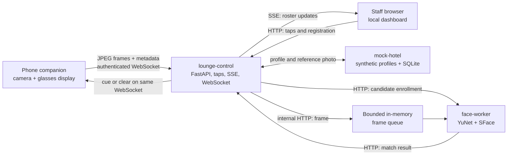
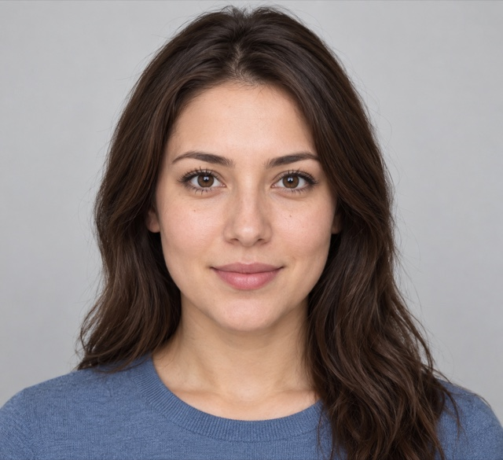

# Face-recognition POC: architecture and demo

**Status:** Local development baseline. The glasses-to-phone camera path is still a proposal and needs validation on the target Rokid device.

## System shape

The POC runs on one laptop with three core Docker Compose services. One `lounge-control` instance can serve multiple paired phones; each phone has its own authenticated WebSocket session.

The **active lounge cohort** is the set of guests currently admitted to the lounge. Guest references and limited display fields live in `lounge-control`; `face-worker` receives opaque candidate IDs and temporary face templates.

### Recognition flow

1. An entry tap tells `lounge-control` to fetch the guest profile and reference photo from `mock-hotel`.
2. `lounge-control` sends the photo and an opaque candidate ID to `face-worker`. The worker derives a template and keeps only its normalized embedding in memory while the guest is in the active lounge cohort.
3. The phone sends sampled JPEG frames plus stream metadata to `lounge-control` over its WebSocket.
4. `lounge-control` validates each frame and forwards it over internal HTTP to the worker's bounded queue. If inference falls behind, the queue drops old frames rather than building latency.
5. `face-worker` detects faces, tracks them between frames, and compares their embeddings with templates for the active lounge cohort. A unique candidate must remain stable for three observations before a match is emitted.
6. `lounge-control` turns a match into a short cue and returns it to the phone over that same WebSocket. Exit or expiry removes the candidate template.

The browser dashboard is a separate staff control surface: it sends tap and guest-registration requests over HTTP and receives roster updates over SSE. The current dashboard screenshot shows its guest controls, registration form, and active roster. Recognition cues go to the phone/replay WebSocket; the browser does not draw a face box or display the cue yet.

## Models

The worker uses OpenCV DNN on the laptop CPU; it does not call a hosted recognition service or require ONNX Runtime.

- **YuNet** (`face_detection_yunet_2023mar.onnx`) detects faces and facial landmarks. OpenCV describes it as a lightweight face detector. [OpenCV YuNet model page](https://github.com/opencv/opencv_zoo/blob/main/models/face_detection_yunet/README.md)
- **SFace** (`face_recognition_sface_2021dec.onnx`) aligns each detected face and produces a 128-value feature embedding. Similarity between a frame embedding and an enrolled guest embedding is calculated with cosine similarity. [OpenCV SFace model page](https://github.com/opencv/opencv_zoo/blob/main/models/face_recognition_sface/README.md)

Model files download on first startup into the named `face-model-cache` Docker volume and are checked against pinned SHA-256 digests. The Python package is `opencv-contrib-python-headless==4.14.0.94`.

Current POC settings are a `0.50` cosine threshold, a `0.10` margin over the next candidate, and three stable frames. OpenCV's sample code uses a different cosine threshold (`0.363`); the POC values are provisional and need evaluation against varied, consented test images. The SFace training-data provenance question is recorded in the [OpenCV Zoo issue tracker](https://github.com/opencv/opencv_zoo/issues/313).

## Local demo

The seeded Alex profile uses the fictional generated test portrait below. Other seeded guests use a person-free placeholder.

1. Start the core services: `docker compose up --build --wait`.
2. Open `http://127.0.0.1:8000/` and admit Alex.
3. Run `docker compose --profile sim run --rm frame-replay`.

The one-shot replay sends three frames through the same WebSocket route used by a phone bridge. In the local smoke run, it returned an `ALEX` cue with the seeded allergy alert. The reference and replay use the same synthetic image, so this checks pipeline wiring and stable-match behavior; it does not measure recognition accuracy across people, lighting, or camera angles.

The staff page is served at `/` by `lounge-control`. Its visible sections are:

- **Guest Tap Ingress:** select a seeded guest, edit the guest reference, and send Admit or Depart taps.
- **Register Mock Hotel Guest:** add a synthetic profile to the local hotel list.
- **Active Lounge Roster:** see admitted guest names and admission times, refreshed through SSE.

For implementation details, see [the face-worker pipeline](../../apps/face-worker/vision.py), [frame replay](../../apps/frame-replay/main.py), and [the POC model notes](../../apps/face-worker/MODELS.md).
