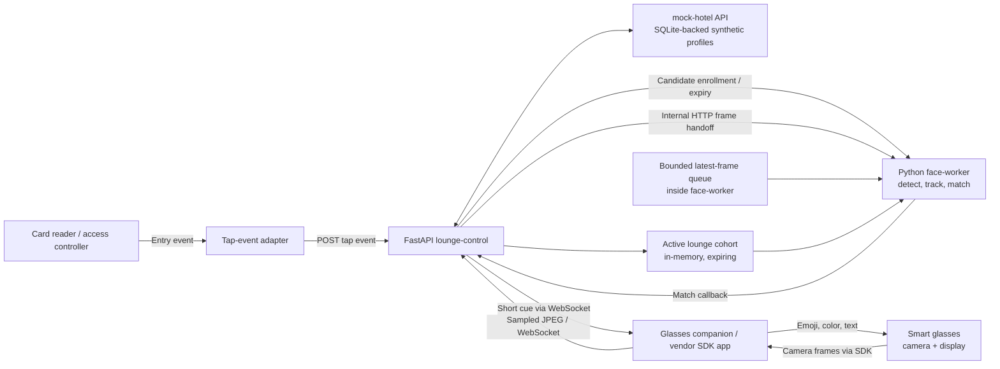

# Hotel Lounge Smart-Glasses POC Architecture

**Status:** Proposed architecture for the proof of concept; the RV101 phone-bridge path is the current working hypothesis. Camera streaming and card-reader integration still need validation.
**Last researched:** 2026-10-06

## Goal

When a guest taps into the lounge, add that guest to a temporary candidate set. A worker's glasses capture the lounge view, a local laptop matches visible faces against that set, and the glasses automatically show a compact guest cue. The worker should not need to confirm each match.

The design separates access events, guest context, image processing, and display so the face-matching method or glasses vendor can change without replacing the entire system.

## Recommended POC shape

- Run a local Docker Compose stack on a laptop connected to a private lounge Wi-Fi network.
- Use **FastAPI + Python** for the `lounge-control` module and the first computer-vision implementation.
- Run `lounge-control` and `face-worker` as separate containers, with small versioned HTTP interfaces between them. Keep inference inside a bounded worker loop in `face-worker`; do not run it in an async request handler.
- For the RV101 working path, pair the glasses to an Android phone running the Rokid app/CXR-L integration. The phone sends camera data over the lounge network to the laptop and receives cues for display on the glasses. Keep this bridge behind a vendor-specific interface.
- Keep the camera transport as a validation gate: the public CXR-L sample currently demonstrates still-photo capture, not a continuous frame stream. Do not claim the end-to-end CV flow is viable until continuous or sufficiently frequent image delivery is proven on the RV101. ([CXR-L sample mirror](https://github.com/e7naq3y/CXR-L-SDK), [photo sample source](https://github.com/e7naq3y/CXR-L-SDK/blob/main/cxrlsample101/app/src/main/java/com/rokid/cxrlsample/activities/photo/PhotoUsageViewModel.kt))
- Send discrete tap events over HTTP; use one device WebSocket to `lounge-control` for sampled JPEG frames and cue updates. `lounge-control` forwards frames to `face-worker` over an internal interface. Use WebRTC or the glasses SDK's native stream if continuous video is needed and supported by the selected device.
- Do not add Kafka for the POC. Keep frames transient and use a bounded in-memory queue inside `face-worker` that drops old frames when recognition is busy.
- Keep guest display context and active guest references in `lounge-control`; keep only opaque candidate IDs and derived face templates in `face-worker`. Both are memory-only and expire. Do not persist camera frames or face crops.
- Run a `mock-hotel` API container backed by a seeded SQLite file for synthetic guest profiles and lounge test data. SQLite is embedded, so this is an API service with a database file, not a separate database server. Active lounge presence and face templates remain in memory with expiry.
- Do not add PySpark to the live path. It is a distributed batch/stream analytics engine, not a profile database or a needed frame-processing layer for this single-laptop POC. Revisit it only for a later offline analytics/replay workload with enough data to justify the extra runtime.

## Module view



The guest data adapter can use a mock local profile store at first. Later it can call the hotel's authorized source for the guest reference, current attributes, and photo. The reader adapter turns the access controller's tap signal into an idempotent event; it must not copy a raw card credential into application logs.

## End-to-end flow

1. **Guest taps in.** The reader adapter sends `event_id`, `reader_id`, a hotel-internal `guest_ref`, event type, and event timestamp to `POST /v1/lounge/taps`.
2. **Resolve the guest.** The profile adapter retrieves only the fields needed for the lounge use case and the reference photo. For the POC, use synthetic profiles and a local mock adapter.
3. **Create a temporary candidate.** The service derives a face template from the reference photo and places the guest reference, limited display fields, template, and expiry in the active cohort. It does not need to keep the photo in the cohort.
4. **Capture and send frames.** The companion app obtains camera frames through the selected glasses SDK. For the first test, it resizes/compresses and sends sampled frames to the laptop. The exact frame size and sampling rate must be measured at actual lounge distances.
5. **Match all visible people.** The CV worker detects faces, tracks each face between frames, computes a query template, and compares it only with the active cohort. It waits for a stable, unique top match across multiple observations before publishing a cue.
6. **Show a cue automatically.** The API sends a short cue to that worker's connected companion app. No guest-confirmation screen or worker confirmation action is part of the normal path.
7. **Clear temporary state.** Exit events, check-out, or a configured presence timeout remove the candidate and its derived template. Lost device sessions clear their display cues.

If there is no stable, unique match, the system must not attach personal fields to that face. It can suppress the cue or show a generic non-identifying state; it should not show a guessed name or allergy. This preserves a seamless normal path while limiting false disclosures.

## First deployment on one laptop

```text
Docker Compose
├── lounge-control
│   ├── FastAPI routes: card taps, health, device WebSocket
│   ├── hotel-profile adapter
│   ├── active-cohort manager: in-memory TTL state
│   ├── device-session manager
│   └── cue composer: role/task filtering and display payload
├── face-worker
│   ├── candidate enrollment: photo → transient face template
│   ├── frame intake and validation
│   ├── bounded per-stream queue: keep latest, discard stale
│   └── CV loop: detect, track, compare, post match callback
└── mock-hotel (dev profile)
    ├── FastAPI profile API
    └── SQLite file on a named Docker volume
        └── synthetic guest profiles and reference photos

Outside Docker
├── Card-reader/access-controller adapter (if vendor integration requires it)
└── Companion app on the paired phone, using the RV101 CXR-L integration
```

The first deployment uses separate containers so the team can own and develop the control and vision modules independently. It does not need Kafka, Redis, PySpark, or a separate database server. `mock-hotel` exposes a small FastAPI API backed by a seeded SQLite file on a named Docker volume; the database contains synthetic records only. Production profile data remains behind the profile adapter. If an external hotel API is available, replace the mock adapter without changing the device or vision interfaces.

## Microarchitecture and team development

Use a small number of deep modules with narrow interfaces. A teammate can change an implementation behind one interface while other modules use its mock adapter or container image.

| Module | Owns | Stable interface | Data it receives |
|---|---|---|---|
| `lounge-control` | Tap handling, profile lookup, active guest state, device sessions, cue composition | `POST /v1/lounge/taps`; device WebSocket; internal match callback | Guest reference, permitted profile fields, device and stream IDs, recognition results |
| `face-worker` | Face detection/tracking, template enrollment, matching, temporal stability, frame backpressure | `PUT /internal/v1/candidates/{id}`; `DELETE /internal/v1/candidates/{id}`; `POST /internal/v1/frames`; `POST /internal/v1/matches` callback | Reference photo at enrollment, opaque candidate IDs, lounge/stream IDs, transient frames; no names, preferences, or allergies |
| `mock-hotel` | Development profiles and synthetic guest photos; SQLite persistence and profile API | `GET /v1/guests/{guest_ref}/lounge-profile` | Synthetic records only |
| `glasses-bridge` | Vendor SDK integration, camera access, display rendering, reconnect behavior | Device WebSocket contract and cue payload schema | Frames from camera; short cue payloads |
| `tap-simulator` | Simulated entry/exit events | Same tap-event interface as the reader adapter | Synthetic guest references |
| `frame-replay` | Deterministic CV integration input | Same device-frame interface as the bridge | Consented/synthetic test images; never real guest data in source control |

Suggested source layout:

```text
apps/
  lounge-control/
  face-worker/
  mock-hotel/
  tap-simulator/
  frame-replay/
contracts/
  tap-event.schema.json
  device-stream.schema.json
  match-event.schema.json
  cue.schema.json
compose.yaml
scripts/
  dev-up.sh
```

Keep each module's implementation in its own directory. Put only shared message schemas and generated clients in `contracts/`; avoid importing another module's private Python package across containers.

### Interfaces between modules

| Caller → receiver | Interface | Expected behavior |
|---|---|---|
| Reader adapter → `lounge-control` | `POST /v1/lounge/taps` | Idempotent on `event_id`; accepts entry/exit events and returns promptly |
| `lounge-control` → `mock-hotel` or hotel adapter | `GET /v1/guests/{guest_ref}/lounge-profile` | Returns a minimal permitted profile and reference photo; mock uses synthetic fixtures |
| `lounge-control` → `face-worker` | `PUT /internal/v1/candidates/{candidate_id}` | Accepts one reference photo plus expiry; derives a template, stores it in RAM, discards the photo; repeated PUT is safe |
| `lounge-control` → `face-worker` | `DELETE /internal/v1/candidates/{candidate_id}` | Removes candidate template and any pending match state |
| `lounge-control` → `face-worker` | `POST /internal/v1/frames` | Binary JPEG body plus `device_id`, `stream_id`, `sequence`, `captured_at`; queues latest frame and returns `202` |
| `face-worker` → `lounge-control` | `POST /internal/v1/matches` | Sends opaque candidate ID, device/stream/track IDs, capture time, and quality state after temporal stability |
| Phone bridge ↔ `lounge-control` | Authenticated device WebSocket | Receives compact frame messages and returns cue/clear/session events |

The HTTP route names are proposed contracts. Store their request/response schemas in `contracts/` and test both callers and receivers against those files. If the face worker restarts, the control module re-enrolls still-active candidates from the profile adapter before resuming cues. If the control module restarts and cannot reconstruct active entries, it starts unavailable and waits for fresh/replayed tap events rather than showing stale matches.

### Internal call sequence

1. `lounge-control` resolves the tap to a guest profile and sends `face-worker` an opaque candidate ID, the reference image, and expiry. `face-worker` derives and stores a template in memory, then discards the image.
2. The phone bridge opens a device WebSocket to `lounge-control`. The control module forwards sampled binary frames to `face-worker` using an internal HTTP call; it does not retain the frame.
3. `face-worker` processes the frame on its bounded queue. For a stable match it posts only the opaque candidate ID, stream ID, track ID, capture time, and quality status to the match callback.
4. `lounge-control` checks that the candidate and device session are still active, looks up the allowed display fields, and sends the cue to that device's WebSocket.

This keeps the most privacy-sensitive recognition logic and the worker-facing guest data in separate modules. It also lets the control module run against a fake recognizer, and the vision module run against a fake control callback.

### Compose startup and local isolation

Provide `compose.yaml`, `.env.example`, one Dockerfile per container, and a small `scripts/dev-up.sh` wrapper. Its normal path can run:

```sh
docker compose --profile dev up --build --wait
```

The `dev` profile starts `lounge-control`, `face-worker`, and `mock-hotel`. An optional `sim` profile adds `tap-simulator` and `frame-replay`. Health checks plus Compose's `depends_on: condition: service_healthy` make startup wait for dependencies; a `--watch` mode can be used for edits where supported. Pin a minimum Docker Compose version of 2.22 if using Compose Watch. ([Compose startup order and health checks](https://docs.docker.com/compose/how-tos/startup-order/), [Compose profiles](https://docs.docker.com/reference/compose-file/profiles/), [Compose Watch](https://docs.docker.com/compose/how-tos/file-watch/))

Each developer can clone the repo or use a separate Git worktree, build their own Compose project, and use local ports, volumes, fixtures, and environment settings. With their local stack already running, a developer changing `face-worker` can rebuild or watch only that container without restarting the other modules, for example with `docker compose up --build -d --no-deps face-worker`. Keep the interface schemas under a shared `contracts/` directory and require each module's tests to validate them. Use separate Compose project names for multiple checkouts on the same laptop; different laptops already have separate Docker daemons.

Compose project names isolate containers, networks, and volumes on a shared development host. The startup script should accept a developer-supplied project name, or derive one from the checkout, so parallel worktrees do not collide. Publish `lounge-control` on loopback by default for simulation; for a physical phone or reader, allow a developer to bind it to the laptop's lounge-network address and provide that address to the bridge. Keep `face-worker` and `mock-hotel` internal to the Compose network. ([Docker Compose project names](https://docs.docker.com/compose/how-tos/project-name/))

Build and pin Linux images for both `linux/amd64` and `linux/arm64`, with CPU inference as the portable baseline. Treat GPU/NPU acceleration as a machine-specific option, not a requirement for the shared dev stack. A Mac, an NVIDIA laptop, and a CPU-only laptop can run the same Compose interfaces, although recognition speed may differ.

Docker provides runtime isolation, but it does not prevent Git edits from conflicting. Keep module code in separate directories, give each contributor ownership of a directory, and change shared contracts through reviewed updates. Use fake adapters and contract tests so each person can work before the physical glasses, card reader, or hotel systems are available.

### What Docker can and cannot start

The backend, mock hotel data, tap simulator, and frame replay tool can all start from one script. The actual glasses SDK app generally runs on its paired phone, and a physical card reader remains external hardware. Those parts need a companion-app build/install or a device connection step; Docker can start their local backend interfaces and simulators, but it cannot replace the vendor SDK or hardware. Meta's toolkit targets iOS/Android companion apps, and Rokid's SDK is specific to its device family. ([Meta Device Access Toolkit](https://developers.meta.com/wearables/device-access-toolkit/), [Rokid Glass3 SDK](https://x-docs.rokid.com/docs/en/terminal-sdk/glasses/))

This repo currently has documentation but no app modules or Dockerfiles, so the proposed startup command is a target workflow rather than a runnable script today. The architecture is viable; implement it after the module skeletons and contracts exist.

### Running the companion app in an Android emulator

This is a useful development path, but it does not make the laptop a physical glasses endpoint:

1. Start the Docker Compose backend and mock hotel data on the laptop.
2. Run the Android companion app in an Android Virtual Device (AVD) to test app-side logic, UI, mock data, and the laptop API. For actual RV101 capture/display integration, use a physical Android phone paired with the glasses unless CXR-L pairing and camera delivery are proven to work in the AVD. For Meta, use MockDeviceKit to simulate the glasses session and camera/media.
3. Feed the emulator from its virtual camera, the laptop webcam, or a replayed video. Run face matching and render/test the cue path against the local backend.
4. From the AVD, reach a server published on the laptop host through Android Emulator's `10.0.2.2` host-loopback alias. This avoids sending development frames over the physical lounge Wi-Fi.

Android Emulator supports virtual camera input and emulated Bluetooth/P2P networking, while Meta provides MockDeviceKit and Rokid documents an Android Phone SDK. The emulator still cannot provide the actual glasses camera/display behavior or prove the vendor's connection to physical glasses. Meta's FAQ also notes limits in mock display-device support; its Android changelog separately documents a local display preview, so verify the exact SDK version and display path used by the prototype. ([Android Emulator camera input and replay](https://developer.android.com/studio/run/emulator-commandline), [Android Emulator networking](https://developer.android.com/studio/run/emulator-networking), [Meta MockDevice FAQ](https://developers.meta.com/wearables/faq/), [Meta Android SDK changelog](https://github.com/facebook/meta-wearables-dat-android/blob/main/CHANGELOG.md), [Rokid Phone SDK](https://x-docs.rokid.com/docs/en/terminal-sdk/phone/))

This removes the physical phone-to-laptop network hop **during development**. In deployment, if glasses capture still flows through a paired phone and the laptop performs inference, that physical link remains. To remove that hop in the live path, move detection/embedding to the companion phone and send only a compact match/result to the laptop, or run matching on the glasses if the exact model exposes that capability. Rokid's Glass3 Enterprise manual describes an offline face-watchlist feature, but that is model- and deployment-specific and must be validated before changing this design. ([Rokid Glass3 Enterprise product manual](https://x-docs.rokid.com/docs/en/terminal-sdk/resources/%E4%BA%A7%E5%93%81%E6%89%8B%E5%86%8C.html))

Measure camera capture time, phone receipt, laptop ingress, inference duration, cue delivery, and display render time separately. That will show whether the network hop is material before moving compute or changing the device flow.

## Interfaces to prototype

### Tap event

```http
POST /v1/lounge/taps
Content-Type: application/json
```

```json
{
  "event_id": "evt-unique-id",
  "reader_id": "lounge-entry-1",
  "guest_ref": "hotel-internal-reference",
  "event_type": "entry",
  "occurred_at": "2026-10-04T12:00:00+08:00"
}
```

Make `event_id` idempotent so reader retries do not create duplicate active entries. Prefer a hotel-internal reference or short-lived token over a card number.

### Device stream

Use one authenticated WebSocket per paired phone/glasses session, for example `/v1/devices/{device_id}/stream`. Send a small metadata message before each binary JPEG frame containing a sequence number, capture time, and stream ID. Return cue updates on the same connection. If the actual SDK provides a media stream rather than discrete frames, keep the media path separate from the control/cue messages.

FastAPI officially supports WebSocket endpoints and Docker deployment. The glasses SDK boundary is vendor-specific: Meta's toolkit connects an iOS/Android app to compatible glasses, and Rokid documents app/phone SDK paths for its device families. Validate capture, display, and local-network permissions against the exact SKU before committing to this interface. ([FastAPI WebSockets](https://fastapi.tiangolo.com/advanced/websockets/), [FastAPI in Docker](https://fastapi.tiangolo.com/deployment/docker/), [Meta Device Access Toolkit](https://developers.meta.com/wearables/device-access-toolkit/), [Rokid Open Platform](https://open.rokid.com/))

## CV and latency behavior

- Decode each incoming frame once, reject malformed or oversized payloads, and attach a monotonic capture timestamp.
- Keep a bounded latest-frame queue per glasses stream. If inference falls behind, drop stale frames instead of building latency.
- Detect and track multiple faces per frame. Match each track independently against the active cohort.
- Emit a match only when the best candidate passes a threshold, is separated sufficiently from the next candidate, and remains stable across several observations. Calibrate these values using representative, consented test data; do not ship default model thresholds as hotel policy.
- Deduplicate cues per track and clear them when the track is gone, the match changes, the guest leaves the active cohort, or the device disconnects.
- Set a provisional POC target such as **under 1 second p95 from frame capture to cue**, then adjust after measuring camera transport, laptop inference, and glasses rendering separately.

## Emoji and color display proposal

Use icon **and** text so color is never the only signal. Keep the first card to two compact rows and validate it on the actual lens:

```text
🟢 ✅ ALEX
🔴 ⚠️ PEANUT ALLERGY
```

Here green indicates an automatic high-confidence match; red plus the warning icon and explicit words indicate a critical profile note. Use a fixed meaning for each color, limit the number of colors, and test contrast, emoji rendering, and color-vision accessibility on the selected device. The allergy wording is intentionally explicit; an emoji alone is too easy to misread. Additional preferences can be revealed only when useful for the active service task.

## Why no Kafka yet

Kafka is designed for durable event streams, replay, and multiple producers/consumers. The initial system has one access-event source, one local recognizer, and one display client per worker; it needs low-latency transient frames, not a durable video log. Kafka would add broker operations, topic/retention configuration, and another place to manage guest-linked event data without solving the main work. Use direct HTTP/WebSocket traffic and the bounded local queue now. Reconsider Kafka only if the system grows to multiple locations, independent downstream consumers, or a real replay/analytics requirement. Even then, publish compact tap/match events—not camera frames. ([Apache Kafka overview](https://kafka.apache.org/documentation.html))

## FastAPI and Python versus Rust

**Recommendation: begin with Python and FastAPI.** FastAPI provides the HTTP and WebSocket control surface; Python keeps the first face-detection/model experiments close to the computer-vision ecosystem. Keep inference off the ASGI event loop in a worker thread or process so slow model calls do not stall tap events or device messages.

Do not plan a full rewrite to Rust before measuring. End-to-end delay may be dominated by camera capture, wireless transfer, face detection/embedding, or device rendering. ONNX Runtime exposes hardware execution providers and profiling/performance tuning from Python; Rust can also call ONNX Runtime through the `ort` binding. A Rust recognizer could later replace the `face-worker` implementation while `lounge-control` remains in Python. Benchmark the same model, input resolution, hardware, and batch/concurrency settings before deciding; the language change alone does not guarantee faster model inference. ([ONNX Runtime Python API](https://onnxruntime.ai/docs/api/python/api_summary.html), [ONNX Runtime performance tuning](https://onnxruntime.ai/docs/performance/tune-performance/), [Rust `ort` binding](https://github.com/pykeio/ort))

If the laptop is a Mac, treat accelerator support inside the Linux containers as an early spike: Docker's standard GPU passthrough documentation describes Windows with WSL 2, so do not assume a container can use Apple's Metal/Neural Engine path. The CV worker can remain separately runnable on the macOS host if CPU-only container inference is too slow. ([Docker GPU support documentation](https://docs.docker.com/desktop/features/gpu/))

## Operational and data boundaries

- Keep laptop, access controller, and companion app on a dedicated trusted network; authenticate paired devices and restrict the edge API to that network.
- Do not persist raw frames, face crops, or embeddings for this POC. Keep derived templates in memory only for active lounge candidates and clear them on exit/expiry.
- Log timing, device health, and aggregate match outcomes. Avoid logging names, preferences, allergies, images, templates, or card credentials.
- If the laptop or stream is unavailable, do not display stale guest cues. Mark the system unavailable and let staff use the normal hotel lookup workflow.
- Treat a room-card tap as an entry signal, not perfect occupancy truth. Use exit taps if the access system supplies them and apply an explicit expiry to missed exits.

## Risks and validation gates

1. **Glasses SDK access:** prove one frame can flow from the glasses through the phone/SDK to the local laptop, and prove a cue can return to the display.
2. **Local network:** test the lounge Wi-Fi with the laptop address fixed and measure packet loss, frame age, and reconnection behavior.
3. **Identity accuracy:** test multiple visible guests, occlusion, lighting, viewing distance, changing camera angles, and guests who are absent from the active cohort.
4. **Throughput:** measure each pipeline stage and the p95 capture-to-cue delay before raising frame rate or moving code to Rust.
5. **Display comprehension:** compare text-only versus icon/color/text cues with hotel workers; measure correct interpretation and false guest associations.
6. **Profile source:** confirm how the card reader resolves a card tap to an authorized guest reference and how entry/exit/check-out events are obtained.
